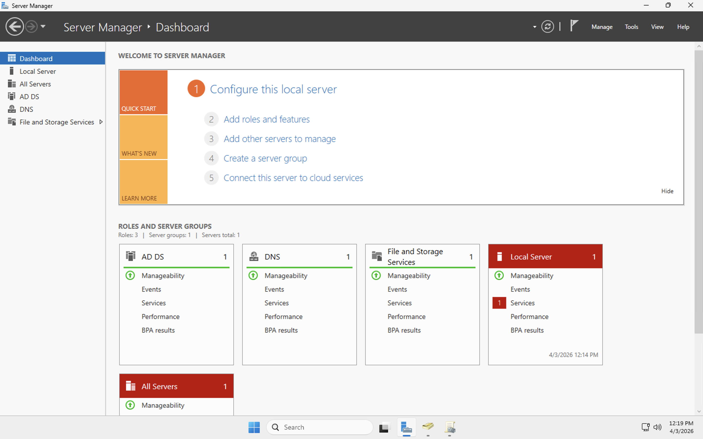
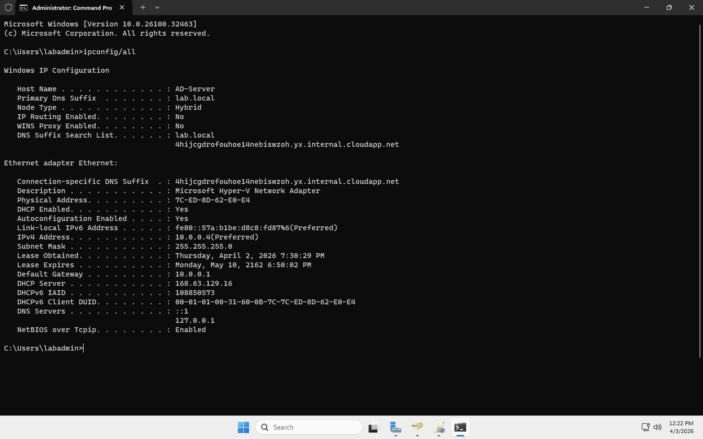
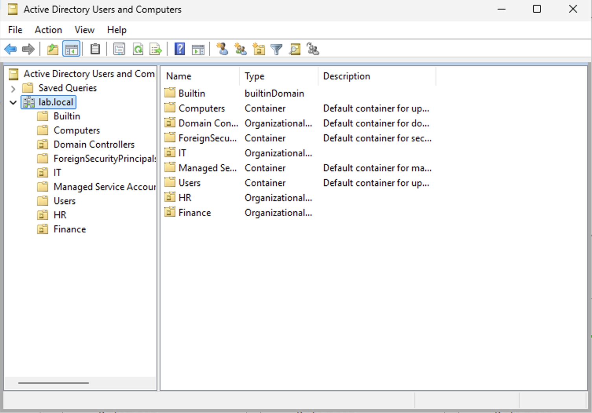
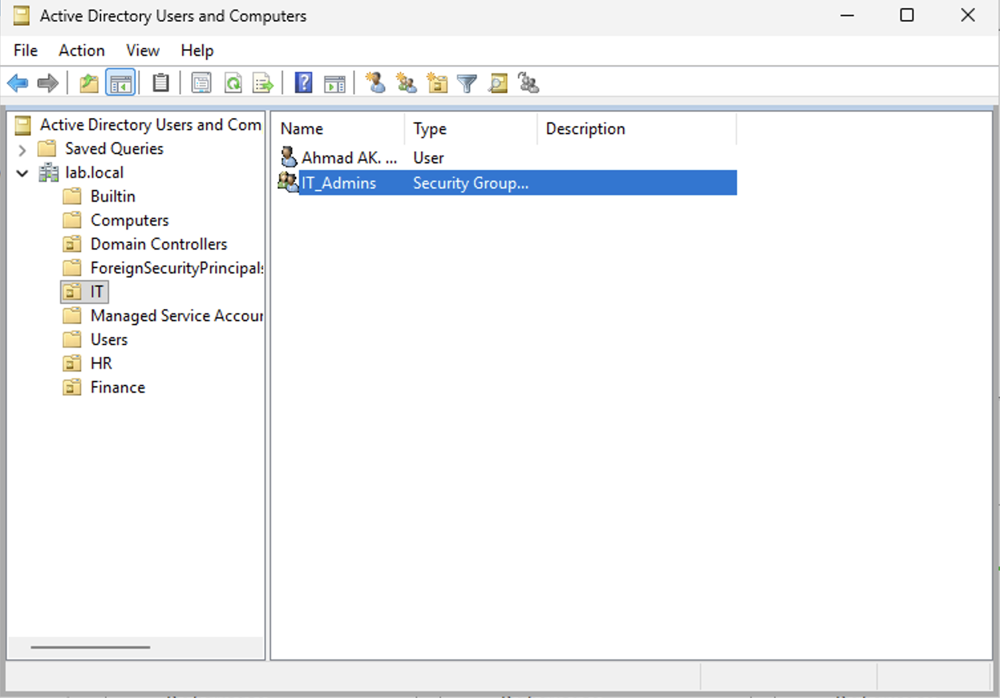
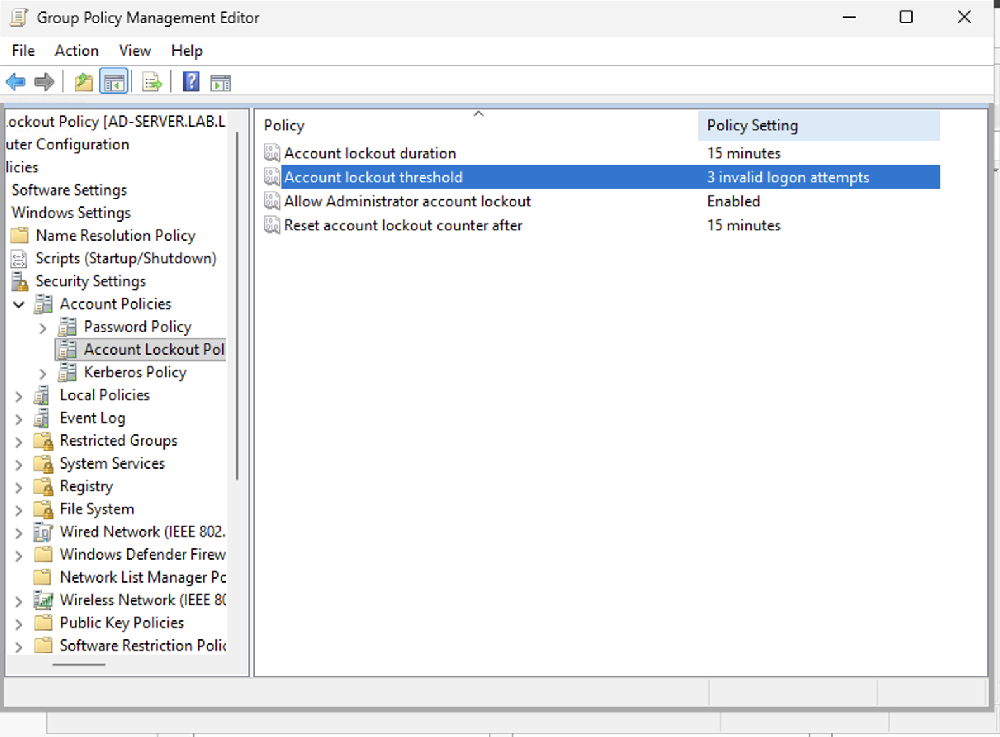
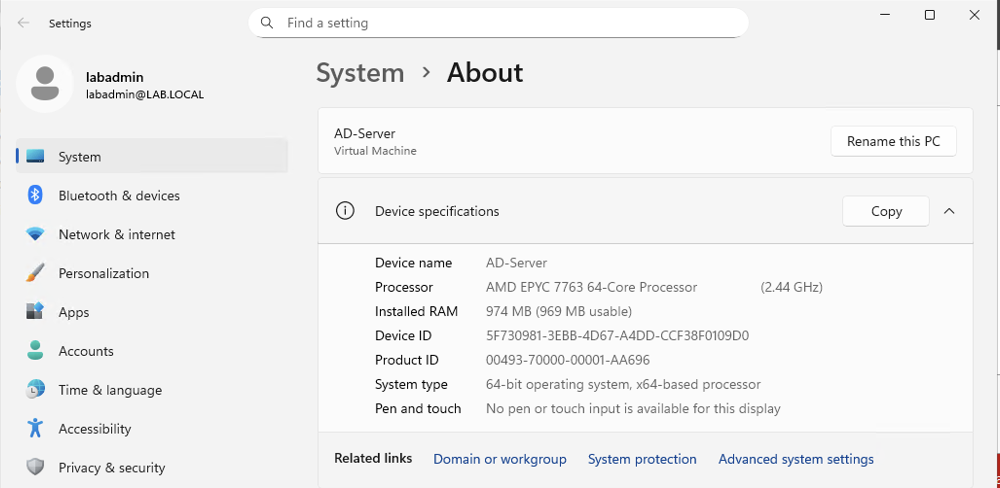
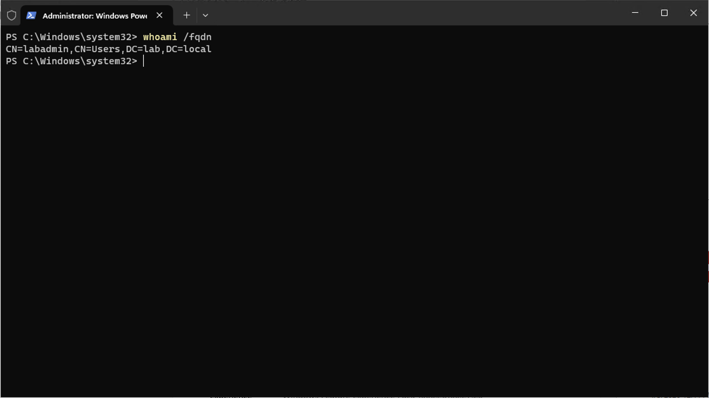

# Active Directory Home Lab

Active Directory home lab simulating enterprise user management, Group Policy, and domain administration using Windows Server.

## 🛠️ Steps Performed

1. Installed Windows Server and configured it as a Domain Controller.
2. Set up Active Directory Domain Services (AD DS) and created the `lab.local` domain.
3. Configured DNS to support domain functionality.
4. Created Organizational Units (OUs) to simulate an enterprise structure.
5. Added and managed user accounts and security groups.
6. Configured Group Policy with an account lockout policy to secure user accounts after 3 failed login attempts.
7. Joined a Windows client machine to the domain.
8. Tested user authentication and access control within the domain.
9. Simulated real-world IT scenarios such as password resets and account lockouts.
10. Troubleshot common issues related to login, DNS, and domain connectivity.

## 📸 Screenshots

## 🔑 Key Skills Demonstrated

- Active Directory installation and configuration  
- DNS setup and management  
- User and group management in AD  
- Group Policy creation and account lockout enforcement  
- Domain-joined client testing and validation  
- Troubleshooting AD, DNS, and login issues
